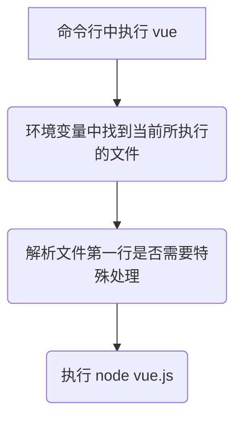

# 如何执行全局命令
以 `@vue/cli` 为例，当全局安装之后，获取环境变量中所使用的 `@vue/cli`：

```bash
which vue
# ~/.nvm/versions/node/v14.17.6/bin/vue
```

当进入到该 目录下后：

```bash
~/.nvm/versions/node/v14.17.6/bin/ && ll
# lrwxrwxrwx vue -> ../lib/node_modules/@vue/cli/bin/vue.js
```

注意到开始的 **l**，说明此处的 `vue` 也是一个软链接进入到， 再次进入对应目录：

```bash
cd ../lib/node_modules/@vue/cli/bin/ && ll
# -rwxr-xr-x vue.js
```

这下终于找到在命令行中输入 `vue` 到底是执行的哪个程序了

然而单纯的在命令行中无法执行 `vue.js`，因为它不是可执行程序，此时查看一下 `vue.js`：

```javascript
#!/usr/bin/env node
···
```

第一行的内容便告诉了系统应当使用 `/usr/bin/env` (即当前用户的环境变量) 中的 `node` 去执行当前文件，即当执行该文件时，会被转译为 `node vue.js`


# 为什么全局安装的 `@vue/cli` 会生成全局命令

查看 `@vue/cli` 中的 package.json：

```json
{
	···
	"bin": {
		"vue": "bin/vue.js"
	}
	···
}
```

此处的 `"vue"` 则对应了安装后全局命令中的名字，`"bin/vue.js"` 则对应了该命令所对应的文件

# npm link/unlink

`npm link` 之后的好处：方便调试，因为是软链接，更改包的内容之后本地引入该包的内容也会同步改变

当在 workspace 中使用 `npm link` 时：
- 将当前包软链接到 `node` 下的 `node_modules` 中
- 如果是全局命令，则会通过 package.json 中配置的 `"bin"` 将文件软链接到命令名称上，再将命令名称软链接到环境变量中的 `node` 的 `bin` 目录下，这样就可以在全局访问到该命令

`npm unlink` 则是删除对应的软链接

---

# ejs 模板渲染

用法：
```javascript
const path = require('path')
const fs = require('fs')
const ejs = require(ejs)

const html = '<div><%= user.name %></div>'
const options = {}
const data = {
	user: {
		name: 'dio'
	}
}

const data2 = {
	user: {
		name: 'jojo'
	}
}

// 用法1：返回 compiled function，用于解析 ejs 模板。适用于需要多次使用同一模板的情况
const template = ejs.compile(html, options)
template(data)  // <div>dio</div>
template(data2)  // <div>jojo</div>

// 用法2：直接生成渲染后的数据
ejs.render(html, data, options)  // <div>dio</div>

// 用法3：处理文件 ejs 模板
// 3.1 返回 Promisj
const file = await ejs.renderFile(path.resolve(__dirname, 'template.ejs'), data, options)
// 3.2 回调的形式接受渲染后的数据
await ejs.renderFile(path.resolve(__dirname, 'template.ejs'), data, options, (err, file) => {
	console.log(file)
})

// 用法4：通过 fileLoader 对结果进行处理，如果模板文件中使用了 include，fileLoader 会多次调用
ejs.fileLoader = function (filePath) {
	const fileContent = fs.readfileSync(filePath).toString()

	return `custom prefix ${fileContent}`
}
```

标签含义：
```text
<% %> js 语句，用于流程控制
<%_ %> 删除该标签当前行之前的所有空格(常放在第一个非空字符前)
<%= %> 将数据解析到模板中
<%- %> 将数据解析到模板中但是不对特殊字符进行转译
<%# %> 注释
<% -%> 删除当前行的换行符(可与其他前置标签联用，例如：<%= -%>)
<% _%> 删除当前行之后的所以空格(常放在最后一个非空字符后)
```

模块导入：
```ejs
<%- include('./module.ejs', { user }) -%>
```

```ejs
<%# module.ejs %>
<div><%= user.name %></div>
```

# glob 类正则文件匹配

[glob](https://en.wikipedia.org/wiki/Glob_(programming)) 最早是出现在类Unix系统的命令行中, 是用来匹配文件路径的。比如，`lib/**/*.js` 匹配 lib 目录下所有以 .js 结尾的文件

用法：
```javascript
const glob = require('glob')

glob('**/*.js',
	{
		ignore: ['node_modules/**']
	}, function(err, file) {
		console.log(err, file)
	})
```