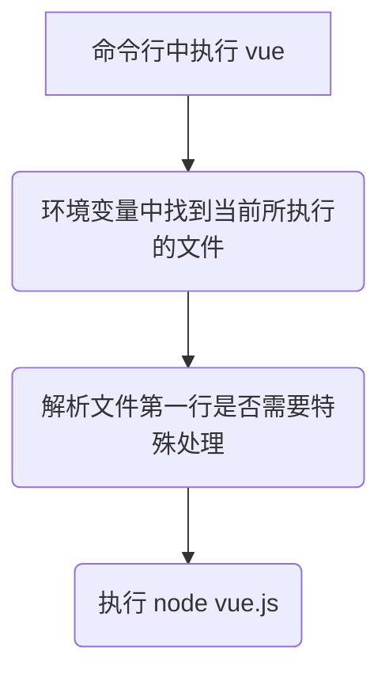

# 如何执行全局命令
以 `@vue/cli` 为例，当全局安装之后，获取环境变量中所使用的 `@vue/cli`：

```bash
which vue
# ~/.nvm/versions/node/v14.17.6/bin/vue
```

当进入到该 目录下后：

```bash
~/.nvm/versions/node/v14.17.6/bin/ && ll
# lrwxrwxrwx vue -> ../lib/node_modules/@vue/cli/bin/vue.js
```

注意到开始的 **l**，说明此处的 `vue` 也是一个软链接进入到， 再次进入对应目录：

```bash
cd ../lib/node_modules/@vue/cli/bin/ && ll
# -rwxr-xr-x vue.js
```

这下终于找到在命令行中输入 `vue` 到底是执行的哪个程序了

然而单纯的在命令行中无法执行 `vue.js`，因为它不是可执行程序，此时查看一下 `vue.js`：

```javascript
#!/usr/bin/env node
···
```

第一行的内容便告诉了系统应当使用 `/usr/bin/env` (即当前用户的环境变量) 中的 `node` 去执行当前文件，即当执行该文件时，会被转译为 `node vue.js`


# 为什么全局安装的 `@vue/cli` 会生成全局命令

查看 `@vue/cli` 中的 package.json：

```json
{
	···
	"bin": {
		"vue": "bin/vue.js"
	}
	···
}
```

此处的 `"vue"` 则对应了安装后全局命令中的名字，`"bin/vue.js"` 则对应了该命令所对应的文件

# npm link/unlink

`npm link` 之后的好处：方便调试，因为是软链接，更改包的内容之后本地引入该包的内容也会同步改变

当在 workspace 中使用 `npm link` 时：
- 将当前包软链接到 `node` 下的 `node_modules` 中
- 如果是全局命令，则会通过 package.json 中配置的 `"bin"` 将文件软链接到命令名称上，再将命令名称软链接到环境变量中的 `node` 的 `bin` 目录下，这样就可以在全局访问到该命令

`npm unlink` 则是删除对应的软链接